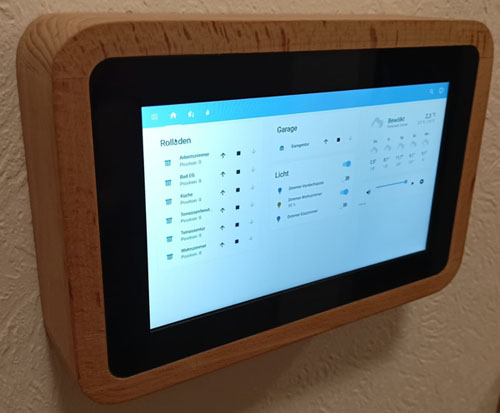

# Raspberry Pi 5 based Home-Assistant Kiosk

I'm building a Home-Assistant kiosk based on
* Raspberry Pi 5 (4GB)
* Touch Display 2
* PoE Hat (F) by Waveshare

and will try to document my progress in this repository. Mostly for myself, as from experience I know my future self will have no idea how I did it in the first place, and things tend to break and eventually require some maintenance.
I've chosen to go with a public repository to share my findings and solutions with whomever may find them helpful.



The picture above is showing my current hardware setup, which is not yet in a final state, but actually a first test of the mount and most importantly, I wanted to see if the Raspberry Pi will heat up in a fully enclosed environment. I'm powering it via PoE, which provides as a side effect some considerable heat. I was immediately annoyed by the sound of the fan that comes with the PoE Hat, so I chose to unplug it. For the initial setups the Raspberry Pi was sitting idle on my desk (using the awesome [3d printable stands](https://www.printables.com/model/1062445-raspberry-pi-touch-display-2-stand) provided by [geerlingguy](https://www.jeffgeerling.com/)) and nevertheless already running at about 58°C. That's probably a result of being sandwiched between the Touch Display 2 and the PoE Hat, but I was afraid it will only get worse in a fully enclosed case. Luckily, I can for now report that while the display's backlight is off the Raspberry Pi still runs at around 58°C.


## OS Setup

Naively, I've went with the default recommendation for Raspberry Pi, and ended up with launching Raspberry Pi OS (bookworm) with Wayland and Labwc. The latter turned out to make research on how to do things quite challenging as they are rather new, and most guidance will be for X11 based systems.

Anyways, I figured out how to rotate the display by 270° into a landscape setup (by default it is portrait). And then began the difficult parts. Happily, I found [geerlingguy](https://github.com/geerlingguy/pi-kiosk) doing a similar project that he openly documents and was able to pick up some hints.

### Disable Screen Backlight when Idle

Add this line to `~/.config/labwc/autostart`:

`swayidle -w timeout 60 'wlopm --off \*' resume 'wlopm --on \*'`

Don't fall for the trap of putting each command on a newline: multiple commands should be separated with an `&`. 

### Dimming Screen

Current brightness can be read and changed via 
`/sys/class/backlight/11-0045/actual_brightness`. Be aware that the maximum brightness (31 for me) value is reported in `/sys/class/backlight/11-0045/max_brightness`.

I struggled finding a way to detect whether the backlight is completely off (via `wlopm`) other than checking `/sys/class/backlight/11-0045/bl_power` which apparently has value 
* 0 if on
* 4 if off

### Touch Gestures

Change `~/.config/labwc/rc.xml` to something along:

```
<?xml version="1.0"?>
<openbox_config xmlns="http://openbox.org/3.4/rc">
    <theme>
        <font place="ActiveWindow">
            <name>PibotoLt</name>
            <size>12</size>
            <weight>Normal</weight>
            <slant>Normal</slant>
        </font>
        <font place="InactiveWindow">
            <name>PibotoLt</name>
            <size>12</size>
            <weight>Normal</weight>
            <slant>Normal</slant>
        </font>
        <name>PiXflat</name>
    </theme>

    <libinput>
        <device category="default">
            <pointerSpeed>0,000000</pointerSpeed>
            <leftHanded>no</leftHanded>
        </device>
        <device category="touch">
            <pointerSpeed>1.0</pointerSpeed>
            <leftHanded>no</leftHanded>
            <tap>yes</tap> <!-- Enable tap-to-click -->
            <tapButtonMap>lmr</tapButtonMap> <!-- Map tap to left, middle, right buttons -->
            <clickMethod>clickfinger</clickMethod> <!-- Enable long-press (right-click) -->
            <sendEventsMode>yes</sendEventsMode>
        </device>
    </libinput>

    <mouse>
        <doubleClickTime>400</doubleClickTime> <!-- Double-click speed -->
    </mouse>

    <keyboard>
        <repeatRate>25</repeatRate>
        <repeatDelay>600</repeatDelay>
    </keyboard>

    <touch deviceName="11-005d Goodix Capacitive TouchScreen" mapToOutput="DSI-2" mouseEmulation="no"/>
</openbox_config>
```

The important parts here seem to be the `device` section with category `touch` and to disable mouse emulation in the `touch` element.

## Home Assistant

I've created a dedicated user to be used for the kiosk. Home Assistant has a very limited user management, but at least you can avoid exposing admin privileges by using an additional user for the kiosk. You can also choose an individual default dashboard and limit visibility of dashboards.

I've started a [python script](ha-client/main.py) that registers the kiosk via the MQTT integration's discovery mechanism.
So far it allows me to control the screen (backlight on/off and dimming) and reports the CPU temperature.
More is planned when adding more hardware (thinking of speaker, status LEDs, motion sensors).